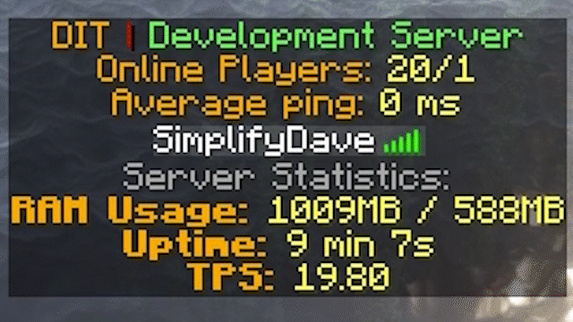
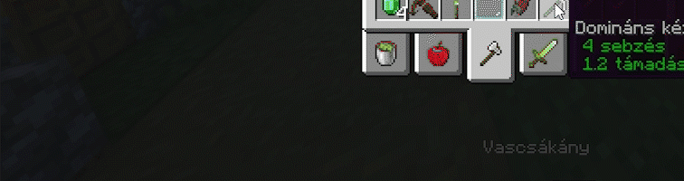

# SimplifyTools  
### An 'All-in-one' helper plugin for Minecraft Spigot Servers with a goal of combine useful plugins to a one.
|  Build Status |                                       |
|:-------------:|:-----------------------------------------------------------------------------------------------------------------:|
|   MC Version  |  |
| Lines of code |                              |
|     Files     |                                     |
## Features

 - **Tab Manager** - Allows you to specify colored texts, with animations on the tab window.
		 Also you can display the average ping, Server RAM statistics.
 
 - **Automatic/command saving** - Allows you to schedule auto saving of the world/player data on your server, or you can initiate a save by a command.
 - **Custom Connect/Disconnect messages** - Allows you to customize the message that is broadcasted when someone joins or leaves the server.
  
 - **Plugin Manager** - Allows you to unload/load plugins without a server restart.
 - **Gameplay statistics** - You can check your gameplay statistics such as player/mob kills, etc.
 (Note: The plugin just shows the stats not recording itself, so stats before installing this plugin are counted too.)
  
 - **Custom Advancement Messages** - You can customize the advancement messages in three categories: advancement, goal, challenge. 
 (Note: The advancement names are currently only can be displayed in english. In future versions there will be a feature to translate to any languages.)
  
 - **Logging** - A logger with fully customizable format for dis/connect, chat, commands actions.
### [Check the config file for more explanation and examples](https://github.com/LabodiDavid/SimplifyTools/blob/main/src/main/resources/config.yml)
_________________
### [Commands & Permissions](docs/cmd_perms.md)
_________________
### If you have an idea or bug report [Create an issue](https://github.com/LabodiDavid/SimplifyTools/issues/new/choose) or [Create a pull request](https://github.com/LabodiDavid/SimplifyTools/compare)
_________________
## Main goal
My main goal is to create a single plugin that has many features, so it's can replace plugins that i often use on my servers while lowering the plugins count.
_________________
## Building 
#### Dependencies:
- spigot-api-1.18.2-R0.1-SNAPSHOT-shaded.jar (from Spigot Repo Downloads Automatically OR **BuildTools** generated `Spigot\Spigot-API\target\`)
- brigadier-1.0.18.jar (from **BuildTools** generated `spigot-x.xx.x.jar\META-INF\libraries\`)
- craftbukkit-1.18.2-R0.1-SNAPSHOT.jar (from downloaded `craftbukkit-x.xx.x.jar\META-INF\versions\`)
##### Installing Dependencies:
You can install the dependencies to your maven repository through CLI like this:

- mvn install:install-file -Dfile=spigot-api-1.18.2-R0.1-SNAPSHOT-shaded.jar -DgroupId=org.spigotmc -DartifactId=spigot-api -Dversion=1.18.2-R0.1-SNAPSHOT -Dpackaging=jar

- mvn install:install-file -Dfile=craftbukkit-1.18.2-R0.1-SNAPSHOT.jar -DgroupId=org.bukkit -DartifactId=craftbukkit -Dversion=1.18.2-R0.1-SNAPSHOT -Dpackaging=jar

- mvn install:install-file -Dfile=brigadier-1.0.18.jar -DgroupId=com.mojang -DartifactId=brigadier -Dversion=1.0.18 -Dpackaging=jar
_________________
## 3rd party libraries used by this plugin
### [Config-Updater by tchristofferson](https://github.com/tchristofferson/Config-Updater)
### [SpigotUpdateChecker by JEFF-Media-GbR](https://github.com/JEFF-Media-GbR/Spigot-UpdateChecker)